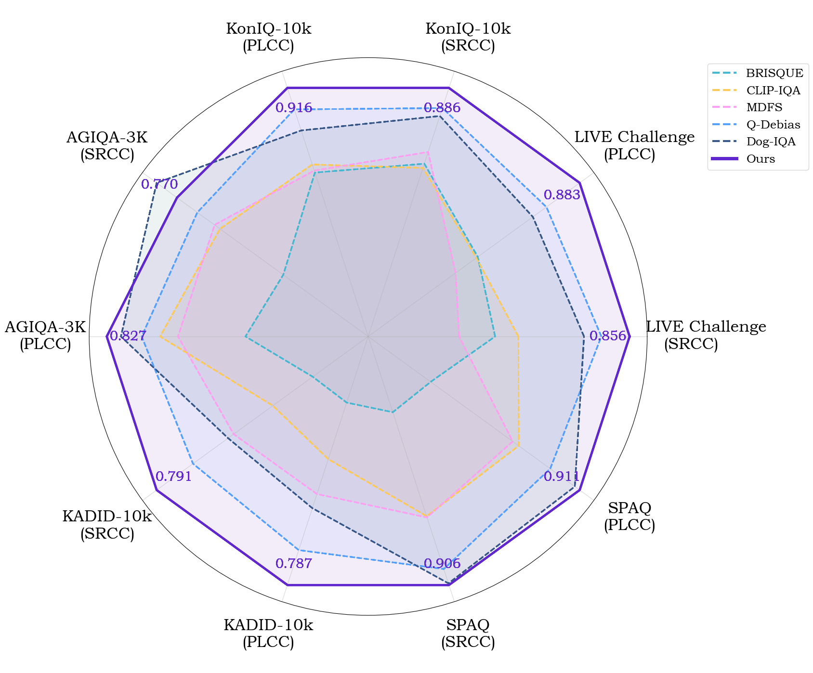

<div align="center">

<h2>Adaptive Logit Weighting for Zero-Shot Quality Assessment with MLLMs</h2>

</div>



- Developed on **mPLUG-Owl3**

## Method

Our approach leverages mPLUG-Owl3 for zero-shot quality assessment through **Adaptive Logit Weighting**. The method consists of the following key components:

### Overview
The framework employs a multi-modal large language model (mPLUG-Owl3) to assess image quality without requiring task-specific training. Instead of relying on traditional fine-tuning approaches, we utilize the model's inherent language understanding capabilities to perform quality assessment through strategic prompt design and logit manipulation.

## Experimental Results

### Comparison with Training-Free SOTA Methods

<div align="center">

**Table 1: Comparison with training-free SOTA IQA methods. The best results are in bold.**

<table>
  <tr>
    <th rowspan="2">Method</th> <th colspan="2">LIVE Challenge</th> <th colspan="2">KonIQ-10k</th> <th colspan="2">AGIQA-3K</th> <th colspan="2">KADID-10k</th> <th colspan="2">SPAQ</th>
  </tr>
  <tr>
    <th>SRCC</th><th>PLCC</th> <th>SRCC</th><th>PLCC</th> <th>SRCC</th><th>PLCC</th> <th>SRCC</th><th>PLCC</th> <th>SRCC</th><th>PLCC</th>
  </tr>
  <tr>
    <td>BIQI</td>
    <td>0.364</td><td>0.447</td> <td>0.559</td><td>0.616</td> <td>0.390</td><td>0.423</td> <td>0.338</td><td>0.405</td> <td>0.591</td><td>0.549</td>
  </tr>
  <tr>
    <td>BLIINDS-II</td>
    <td>0.090</td><td>0.107</td> <td>0.585</td><td>0.598</td> <td>0.454</td><td>0.510</td> <td>0.224</td><td>0.313</td> <td>0.317</td><td>0.326</td>
  </tr>
  <tr>
    <td>BRISQUE</td>
    <td>0.561</td><td>0.598</td> <td>0.705</td><td>0.707</td> <td>0.493</td><td>0.533</td> <td>0.330</td><td>0.370</td> <td>0.484</td><td>0.481</td>
  </tr>
  <tr>
    <td>NIQE</td>
    <td>0.463</td><td>0.491</td> <td>0.551</td><td>0.488</td> <td>0.529</td><td>0.520</td> <td>0.379</td><td>0.389</td> <td>0.703</td><td>0.671</td>
  </tr>
  <tr>
    <td>CLIP-IQA</td>
    <td>0.612</td><td>0.594</td> <td>0.695</td><td>0.727</td> <td>0.658</td><td>0.714</td> <td>0.500</td><td>0.520</td> <td>0.738</td><td>0.735</td>
  </tr>
  <tr>
    <td>MDFS</td>
    <td>0.482</td><td>0.536</td> <td>0.733</td><td>0.712</td> <td>0.672</td><td>0.676</td> <td>0.598</td><td>0.594</td> <td>0.741</td><td>0.718</td>
  </tr>
  <tr>
    <td>Q-Debias</td>
    <td>0.794</td><td>0.790</td> <td>0.838</td><td>0.863</td> <td>0.717</td><td>0.753</td> <td>0.700</td><td>0.713</td> <td>0.867</td><td>0.826</td>
  </tr>
  <tr>
    <td>Dog-IQA</td>
    <td>0.756</td><td>0.752</td> <td>0.819</td><td>0.811</td> <td><b>0.823</b></td><td>0.797</td> <td>0.612</td><td>0.624</td> <td>0.902</td><td>0.897</td>
  </tr>
  <tr>
    <td><b>Ours</b></td>
    <td><b>0.856</b></td><td><b>0.883</b></td> <td><b>0.886</b></td><td><b>0.916</b></td> <td>0.770</td><td><b>0.827</b></td> <td><b>0.791</b></td><td><b>0.787</b></td> <td><b>0.906</b></td><td><b>0.911</b></td>
  </tr>
</table>

</div>

### Performance Comparison with Different Prompt Styles

<div align="center">

**Table 2: Performance on (SRCC+PLCC)/2 of popular methods implemented with the same prompts and based on mPLUG-Owl3. Best results are in bold.**

| Category | Dataset | Q-Bench style | Q-Align style | **Ours** |
|----------|---------|:-------------:|:-------------:|:--------:|
| **Artificial** | KADID-10k | 0.649 | 0.651 | **0.779** |
|  | LIVE | 0.751 | 0.777 | **0.887** |
|  | CSIQ | 0.771 | 0.748 | **0.828** |
| **UGC** | KonIQ-10k | 0.748 | 0.847 | **0.900** |
|  | SPAQ | 0.828 | 0.900 | **0.913** |
|  | LIVEC | 0.676 | 0.831 | **0.869** |
| **AIGC** | AGIQA-3K | 0.722 | 0.771 | **0.795** |

</div>

Our method consistently outperforms existing training-free approaches across multiple datasets and categories, demonstrating the effectiveness of the adaptive logit weighting strategy for zero-shot quality assessment.

## Usage

### Requirements
```bash
cd mPLUG-Owl3
pip install -r requirements.txt
```

### Configuration

The method supports both Image Quality Assessment (IQA) and Image Aesthetic Assessment (IAA). Configuration files are available:
- `mPLUG-Owl3/iqa.yml` - Configuration for quality assessment datasets
- `mPLUG-Owl3/iaa.yml` - Configuration for aesthetic assessment datasets
